# LaserStorm Force Builder - User Guide

Everything you need to design units, assemble armies, and print reference sheets.
This guide covers how to *use the app*; for the game's rules you'll need the
**LaserStorm (2nd Edition)** rulebook.

> **New here?** Jump straight to the
> [Quick start](#2-quick-start-build-your-first-army) and build a complete army
> in about ten minutes.

> **About this guide:** The app's terminology comes from the LaserStorm rulebook.
> This guide explains how to use the app's controls; the rulebook is your reference
> for what those choices mean in a game. As you work, the app provides in-context
> help alongside each decision.

## Contents

1. [Key concepts](#1-key-concepts)
2. [Quick start: Build your first army](#2-quick-start-build-your-first-army)
3. [The Unit Builder](#3-the-unit-builder)
4. [Factions](#4-factions)
5. [The Unit Library](#5-the-unit-library)
6. [Task Forces](#6-task-forces)
7. [Armies & battle groups](#7-armies--battle-groups)
8. [Expeditionary Forces](#8-expeditionary-forces)
9. [Printing](#9-printing)
10. [Sharing & importing](#10-sharing--importing)
11. [Backing up your data](#11-backing-up-your-data)
12. [Tips & shortcuts](#12-tips--shortcuts)

---

## 1. Key concepts

The app is organized as five layers that build on each other. Understanding how
they nest makes everything else click:

| Layer | What it is |
|---|---|
| **Unit** | A single entry you design - a stat line, traits, and weapons. A **Stand** is a single game piece; a **Unit** represents one or more **Stands** (how many depends on its class). |
| **Task Force** | A rules-aware grouping of units into **role slots** - core, specialist, command, and support - with a Task Force Commander and a tactical asset. |
| **Army** | What you field in a game. Either built from **task forces** or **free-picked** from units directly, then organized into **battle groups**. |
| **Battle Group** | A named sub-formation inside an army, with its own symbol, holding a selection of the army's units. |
| **Expeditionary Force** | A campaign-level collection of several armies, sorted into **army groups**. |

A few terms you'll meet throughout:

- **Class** - a unit's type (Infantry, Cavalry, Field Gun, Scout, AFV, Aircraft,
  Super Heavy, Behemoth). Class sets the default number of stands, the save
  dice, and which deployment roles are allowed.
- **Deployment type** - each unit in your army can be a plain **Unit**, a
  single-stand **Independent**, a **Commander**, a **Hero**, or a
  **Hero Commander**. Each costs progressively more, and the builder shows all
  costs side by side.
- **Stand Traits** / **Weapon Traits** - special abilities you pick from a list.
  Each one adjusts the unit's point cost automatically.
- **Points** - every cost is calculated for you as you build; you never add
  anything up by hand.

Everything you create is saved automatically in your browser. There's no save
button for your collection - see [Backing up your data](#11-backing-up-your-data).

---

## 2. Quick start: Build your first army

This walkthrough takes you from an empty app to a printable army.

### Step 1 - (Optional) Create a faction

Open the **Factions** tab and click **New Faction**. Give it a name, pick a
color and an icon, and save. Factions are optional, but they keep your units
organized and color-coded. You can also just use the five built-in factions, or
none at all.

### Step 2 - Build a unit

Go to the **Unit Builder**. Enter a name, choose a **Class**, and (optionally)
assign your faction. Set the combat stats, add any stand traits and weapons, and
watch the **Calculated Points** panel update live. When you're happy, click
**Save to Library**.

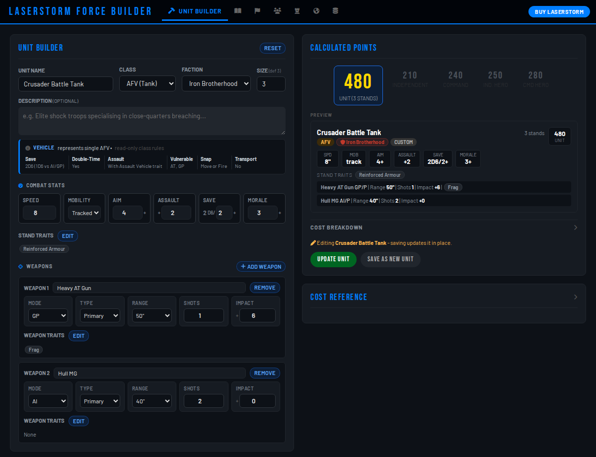

Repeat for a few more units: a couple of fighting units, maybe a command unit,
and some support. Each one lands in your **Unit Library**.

### Step 3 - Create a task force

Open **Task Forces → New Task Force**, name it, and pick a **type**. In the task
force you'll see four role sections - **Core**, **Specialist**, **Command**, and
**Support**. Use **+ Add** in each section to drop your units into the right
slots, and set how many of each unit you want.

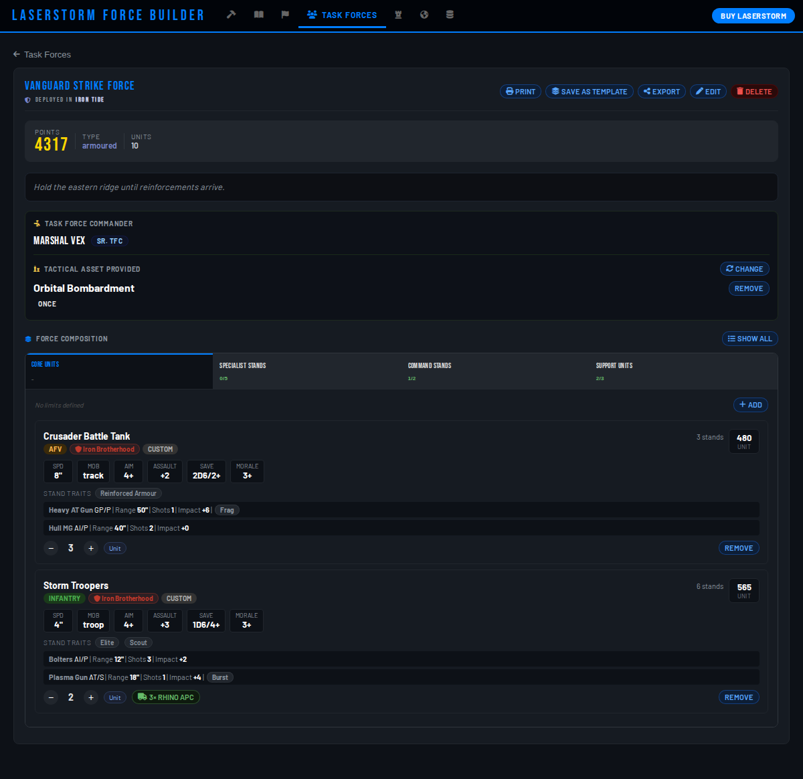

Optionally name a **Task Force Commander** and assign a **tactical asset**.

### Step 4 - Build an army

Open **Armies → New Army**. Choose a **task-force army** and add your task force
to its pool. Then create **Battle Groups**, give each a name and symbol, and add
units to them from your task force.

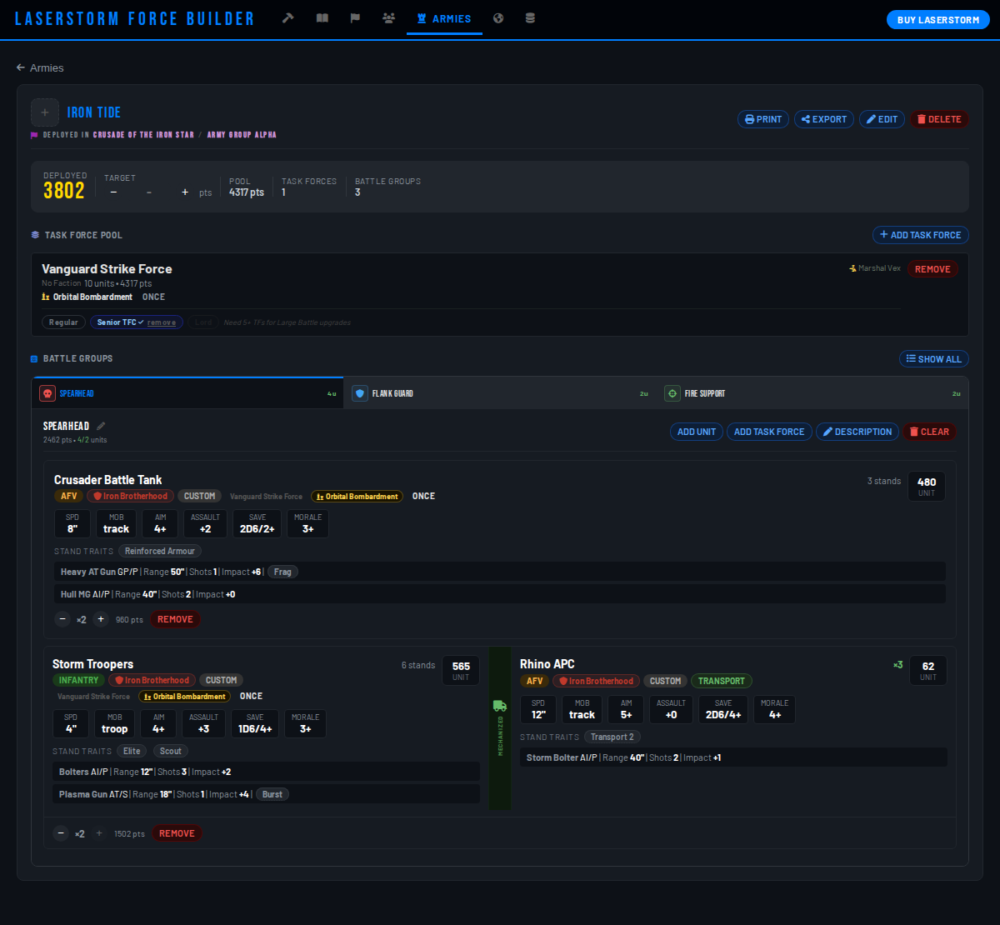

### Step 5 - Print and back up

From the army (or task force) click **Print**, choose paper size and color or
grayscale, and print your reference sheet. Finally, head to the **Data** tab and
click **Full Backup** to save a copy of everything - see
[Backing up your data](#11-backing-up-your-data).

That's the whole loop. The rest of this guide explains each piece in depth.

---

## 3. The Unit Builder

The builder is where you design a unit. The left side is the form; the right side
shows the live cost and a preview.

### Identity

- **Unit name**, an optional **description**, and a **faction** (or *No Faction*).
- **Class** - sets the unit's character. A short, read-only summary of the
  class's rules appears just below the selector.
- **Size** - how many **Stands** the **Unit** represents. It defaults to the class's
  standard size; you can adjust it.

### Combat stats

Set **Speed**, **Mobility**, **Aim**, **Assault**, **Save**, and **Morale**.
Some classes add a mobility option (such as walker or grav) that affects the cost.

### Stand traits

Click **Edit** next to *Stand Traits* to pick from the available traits. Only
traits valid for the unit are offered, and each one adjusts the cost. Some traits
can be taken more than once.

### Weapons

Click **+ Add Weapon** to add a weapon system. For each weapon set its **Mode**,
**Type**, **Range**, **Shots**, and **Impact**, and use **Edit** under *Weapon
Traits* to add weapon traits. Add as many weapons as the unit carries; **Remove**
drops one.

### Calculated points

The **Calculated Points** panel shows the cost to field the unit in each
deployment type - **Unit**, **Independent**, **Commander**, **Hero**, and
**Hero Commander** - with the per-stand and full-unit values. Open **Cost
Breakdown** to see exactly what each stat, trait, and weapon contributes. Roles
the class can't take are grayed out.

### Saving

- **Save to Library** stores a brand-new unit.
- When you're **editing** an existing unit, you instead get **Update Unit**
  (save changes in place) and **Save as New Unit** (branch off a copy).
- **Reset** clears the form to start fresh.

You can re-open any custom unit later with **Edit**, or duplicate one with
**Clone** (from the [library](#5-the-unit-library) or a faction page).

---

## 4. Factions

Factions group your units and give them a color and icon. Open the **Factions**
tab to see the five **built-in** factions and any **custom** ones you've made.

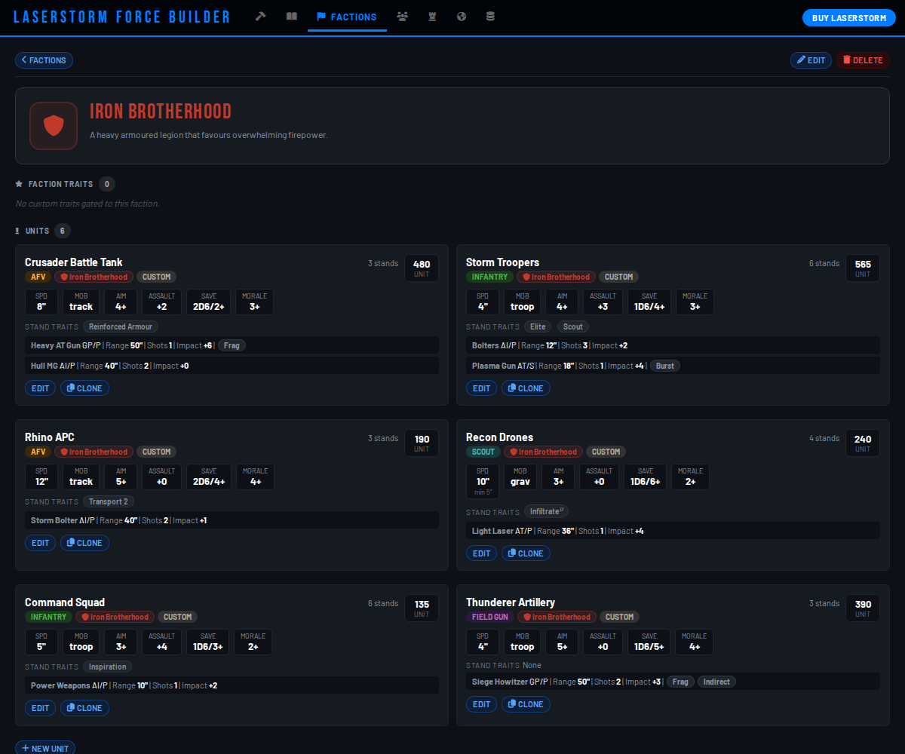

- **New Faction** - set a name, color, icon, and optional description.
- A faction's page lists its **units** and any **faction traits**, with
  **Edit**/**Delete** for the faction itself.
- You can add units to a faction straight from its page with **New Unit**, or by
  choosing the faction in the [Unit Builder](#3-the-unit-builder).

Factions are organizational; assigning one never changes a unit's stats.

---

## 5. The Unit Library

The library lists every unit - both the built-in stock units and everything
you've created.

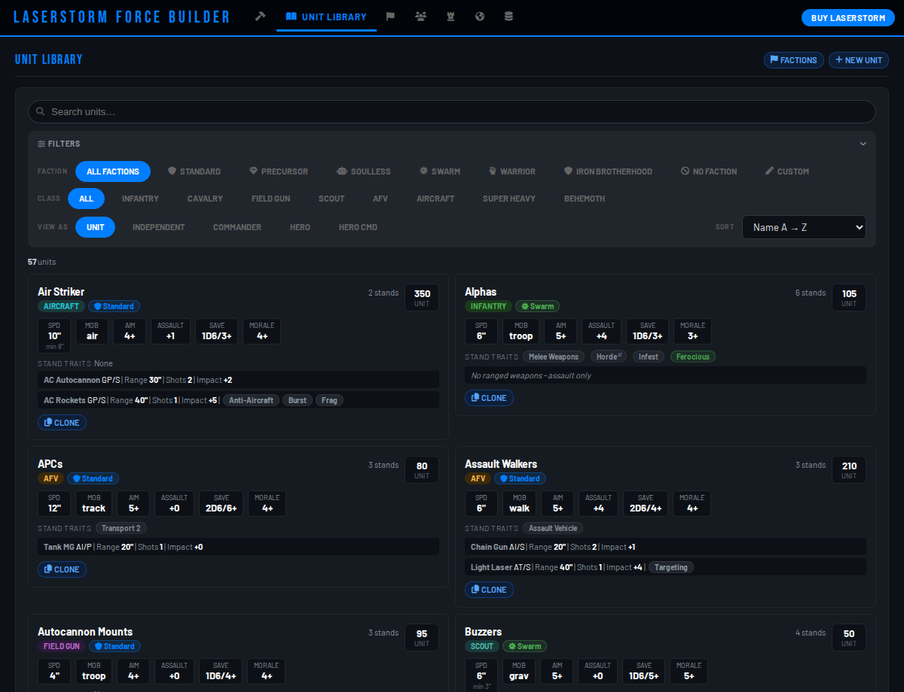

- **Search** by name.
- **Filters** narrow by **faction** and **class**. On a phone the filter panel
  starts collapsed - tap **Filters** to open it.
- **View as** switches the displayed points between deployment types (Unit,
  Independent, Commander, Hero, Hero Commander), so you can compare costs.
- **Sort** by name, points, class, or any stat.
- **Clone** duplicates a unit into a new custom copy you can edit.
- **+ New Unit** jumps to the builder.

---

## 6. Task Forces

A task force organizes units into role slots and is the building block for
task-force armies.

### Creating one

From the **Task Forces** tab use **New Task Force**, give it a name, and choose a
**type**. The type defines how many slots each role allows. **Templates** lets
you start from a saved type, and **Import** brings in a shared task force.

### Role sections

A task force has four sections - **Core**, **Specialist**, **Command**, and
**Support**. Each section header shows how full it is against the type's limits.
Use **+ Add** to put a unit into a section and set its **quantity**. For each
slot you can also choose its **deployment type** (Unit, Independent, Commander,
and so on) and **Remove** it.

Toggle **Show All** to switch between the tabbed view (one role at a time) and a
flat view (every section stacked).

### Task Force Commander & tactical asset

Each task force has a **Task Force Commander**: a single named officer who leads
it and unlocks its **tactical asset**. This is different from a unit's **Commander**
deployment type (see [Key concepts](#1-key-concepts)). Set the commander's rank to
Regular, Senior, or Lord; higher ranks unlock more, and the app flags any
requirements you haven't met yet.

- **Assign** a **tactical asset** - a special battlefield ability - from the
  built-in list or your own custom assets. **Change** or **Remove** it anytime.

### Mechanized transports

Infantry and field-gun slots can be carried by a transport. Use the transport
button on the slot to assign a vehicle that has the *Transport* trait; the unit
then deploys **mechanized** and is shown paired with its transport on cards and
printed sheets.

### Task-force actions

The header buttons let you **Print**, **Save as Template** (turn this task
force's composition into a reusable type), **Export** (share it as JSON, with all
its units bundled in), **Edit**, or **Delete** it.

---

## 7. Armies & battle groups

An army is what you bring to a game. Open the **Armies** tab and use **New Army**.
There are two kinds:

- **Task-force army** - built from one or more task forces in a **pool**, then
  organized into battle groups.
- **Free-pick army** - pick units directly, without task forces.

### The army header

A stat strip shows the army's **deployed** points, an optional **target**, the
**pool** total, and how many task forces and battle groups it has. The header
buttons **Print**, **Export**, **Edit**, and **Delete** the army.

### The task-force pool (task-force armies)

**Add Task Force** drops a task force into the pool. Each pooled task force shows
its Task Force Commander and lets you set the commander rank used in this army. The pool is
the source you draw units from when filling battle groups.

### Battle groups

Battle groups are named sub-formations, each with a **symbol**. Switch between
them with the tabs, and for the selected group:

- **Add Unit** adds units to the group - from the pool's task forces (task-force army) or
  directly (free-pick army).
- **Add Task Force** (task-force armies) adds all units from a task force at once.
- **Description** adds notes; **Clear** empties the group.
- Adjust each entry's **quantity**, or **Remove** it.

Click a group's symbol to change it. Use **Show All** to see every group at once.

---

## 8. Expeditionary Forces

An expeditionary force collects several armies for a campaign. Open the
**Expeditionary Forces** tab and use **New**.

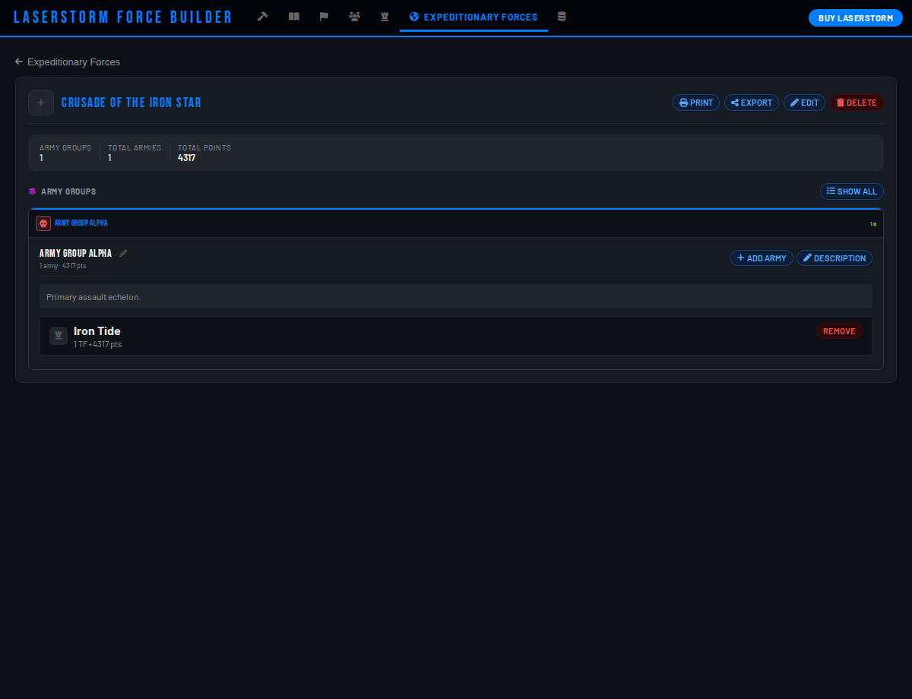

- An expeditionary force is divided into **army groups**.
- For each army group, **Add Army** assigns armies to it and **Description** adds
  notes.
- The header shows totals across the whole force and lets you **Print**,
  **Export**, **Edit**, or **Delete** it.

---

## 9. Printing

You can print a reference sheet for a **task force**, an **army**, or an
**expeditionary force** from the **Print** button on its detail page.

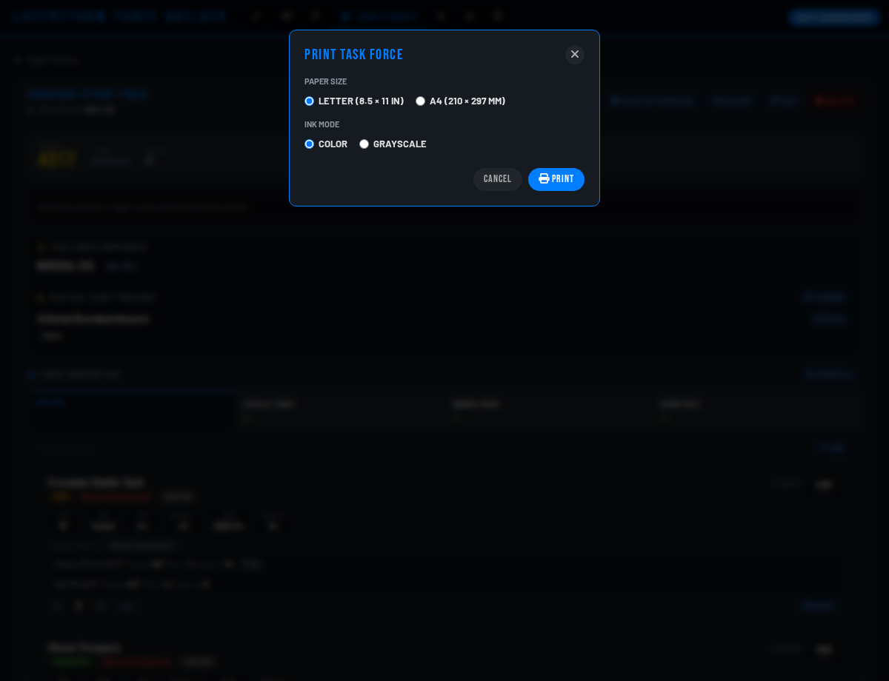

Choose your options:

- **Paper size** - Letter or A4.
- **Ink mode** - **Color**, or **Grayscale** for clean black-and-white printing
  that doesn't burn through colored ink.

Click **Print** and a formatted sheet opens in a new tab, ready for your
browser's print dialog (or "Save as PDF"). The sheet leads with an overview and
roster, then gives a full card for every unit, and paginates automatically.

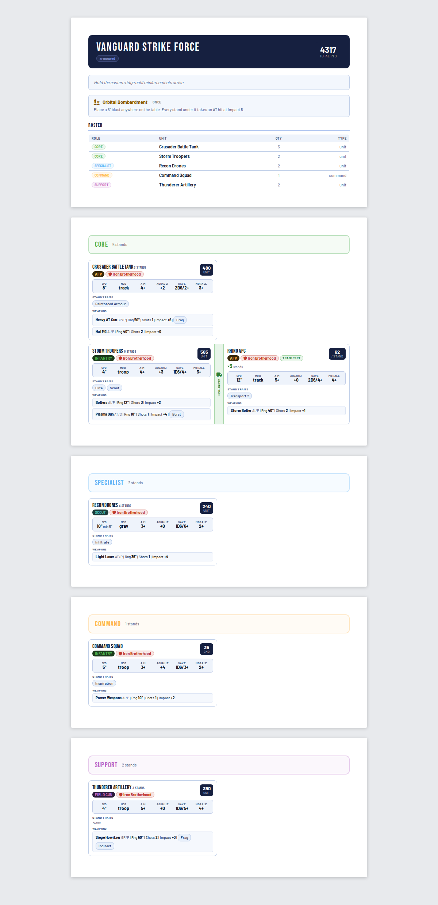

---

## 10. Sharing & importing

Everything you make can be exported as JSON and shared, and you can import what
others send you. The **Data** tab is the hub.

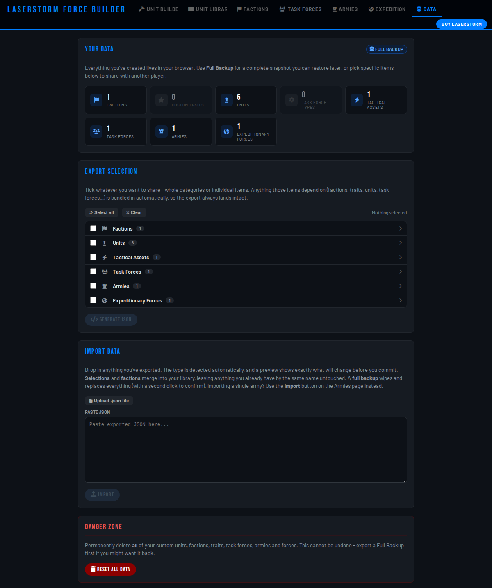

### Exporting a selection

Under **Export Selection**, tick whole categories or individual items, then
**Generate JSON**. A panel opens with the result - use **Copy to clipboard** or
**Download** to save it as a `.json` file. The export automatically pulls in
everything those items depend on - tick a task force and its units, their factions,
and their custom traits all come along - so the file is always complete.

### Full backup

**Full Backup** (top of the Data tab) exports your *entire* collection in one
file. This is also your safety net - see
[Backing up your data](#11-backing-up-your-data).

### Exporting a single army / task force / force

The **Export** button on an army, task force, or expeditionary force detail page
exports just that item, bundled with all of its dependencies.

### Importing

Under **Import Data**, paste a JSON export into the box or use **Upload .json**.
The app recognizes what it is:

> **Warning:** Importing a full backup **replaces your entire collection**. Export
> your own Full Backup first if you have work you want to keep.

- A **full backup** replaces your whole collection.
- A **selection**, **faction**, or single-item export **merges** into what you
  have, skipping duplicates (matched by name) and giving imported task forces,
  armies, and forces fresh IDs so nothing collides.

Every export carries its dependencies, so a shared file always lands intact on
someone else's copy.

---

## 11. Backing up your data

**Your collection lives only in your browser's local storage, on this device.**
It is not synced to any account or cloud. Clearing your browsing data, or moving
to a different browser or device, will not bring it with you.

So: **export a Full Backup regularly.** Open the **Data** tab and click **Full
Backup**, then keep the downloaded file somewhere safe. To restore it later (or
on another device), [import](#10-sharing--importing) that file.

Once you've built up some work, the app shows a reminder banner if it's been a
while since your last backup:

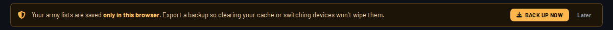

- **Back up now** opens the Full Backup export.
- **Later** dismisses it for a while; it returns if you keep building without
  backing up.

The Data tab also has a **Danger Zone** that erases everything - it asks for
confirmation, and you should take a Full Backup first if there's any chance you'll
want your work back.

---

## 12. Tips & shortcuts

- **Undo** - made a mistake? Press **Ctrl+Z** (or **Cmd+Z** on a Mac), or use the
  **Undo** button in the top bar. Undo history is per-session and isn't kept
  after a reload.
- **Works offline** - after the first load the app needs no connection. At the
  table, use your browser's **"Add to Home Screen"** to keep it one tap away.
- **It's responsive** - the whole app works on a phone, with layouts that adapt
  to small screens.

  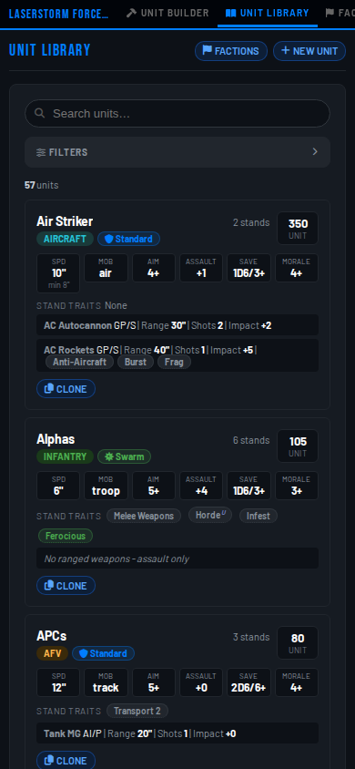

- **Back up before big changes** - especially before using the Data tab's Danger
  Zone or importing a full backup (which replaces everything).

---

*Happy list-building. For the rules of the game itself, see
[LaserStorm (2nd Edition)](https://www.wargamevault.com/product/476399/laserstorm-2nd-edition?affiliate_id=564654).*
